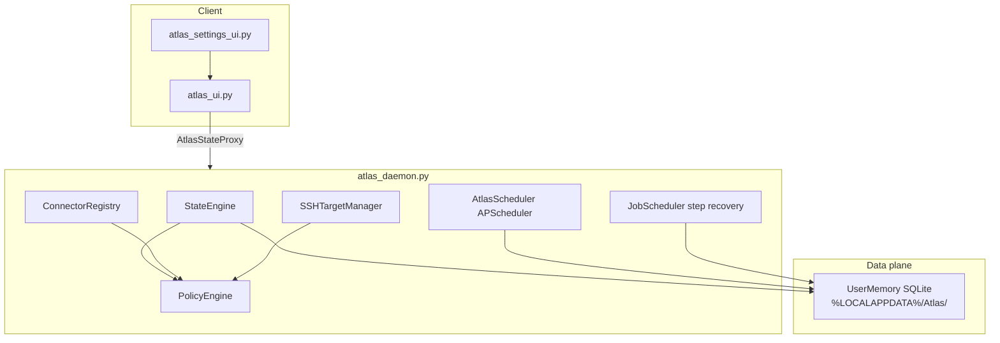

# Atlas

Desktop AI assistant with screen awareness, guided automation, scheduled jobs, and policy-gated file/shell access. The UI talks to a background **daemon** over localhost HTTP/WebSocket; all durable state lives in **SQLite** under `%LOCALAPPDATA%\Atlas\`.

## Architecture



**Runtime:** Production use is **daemon-only**. `atlas_ui.py` exits if `atlas_daemon` is not reachable. Embedded `StateEngine` is for tests (`tests/harness.py`) and scripts only.

**Memory:** Session takeaways, facts, prefs, scheduler metadata, and job state are in `UserMemory` SQLite. Legacy `~/.atlas-data/memory_store.json` is migrated once on first open.

## Quick start (Windows)

1. Install [Tesseract OCR](https://github.com/UB-Mannheim/tesseract/wiki) — see `INSTALL_WINDOWS.txt`.
2. `python -m pip install -r requirements.txt`
3. Create `.env` with `GROQ_API_KEY=...`
4. `python verify_env.py`
5. Start daemon (or let UI auto-start): `python -m atlas_daemon`
6. `python atlas_ui.py`

Recommended: install daemon at logon:

```powershell
powershell -ExecutionPolicy Bypass -File scripts\install_atlas_daemon.ps1
```

## Safety mode

Canonical default: `off` (`atlas_data.DEFAULT_SAFETY_MODE`).

| Stored value | UI label (approx.) | Behavior |
|--------------|----------------------|----------|
| `off` | Auto / minimal prompts | Routine and trusted paths may auto-approve per policy |
| `always` | Confirm each step | Every risky action needs explicit confirmation |
| `trusted` | Trusted apps only | Gates apply mainly to non-trusted targets |

Prefs reload on account switch; FS policy syncs on daemon `set_user` and safety changes.

## Module map

| Module | Role |
|--------|------|
| `atlas_ui.py` | Main window, chat, overlay hooks, permission dialogs |
| `atlas_settings_ui.py` | Accounts, security, connectors, scheduler tabs |
| `atlas_daemon.py` | FastAPI service, owns `StateEngine` and schedulers |
| `atlas_state_proxy.py` | UI-side proxy to daemon |
| `atlas_ipc.py` | `DaemonClient`, `ensure_daemon_running()` |
| `atlas_core.py` | `StateEngine` — chat, tasks, routines, connectors |
| `atlas_memory.py` | `UserMemory` SQLite (facts, prefs, takeaways, scheduler) |
| `atlas_memory_manager.py` | Deprecated shim → `UserMemory` |
| `atlas_policy.py` / `atlas_fs_v2.py` | Permission and scoped filesystem |
| `atlas_apscheduler.py` | Cron jobs, weekly routine, connector dispatch |
| `atlas_scheduler.py` | `JobScheduler` — multi-step job recovery |
| `atlas_connectors/` | GitHub, Paystack, Gmail/Notion stubs |
| `atlas_overlay.py` | Holo overlay, DPI scaling, WCAG captions |
| `atlas_recorder.py` | Demonstration capture for learn-and-execute |
| `atlas_task_safety.py` | Task loop guards and confirmation |
| `atlas_playbooks.py` | Saved automation playbooks |
| `atlas_shell.py` | Policy-gated shell execution |

## API namespaces (daemon)

- **Jobs:** `POST /api/jobs/enqueue`, `GET /api/jobs/{id}` (`JobScheduler`)
- **Scheduler:** `GET /api/scheduler/pending`, `POST /api/scheduler/pending/{id}/resolve`, definitions, weekly routine, activity (`AtlasScheduler`)
- Legacy `/api/scheduler/enqueue` aliases log a deprecation warning.

## Data paths

| Path | Contents |
|------|----------|
| `%LOCALAPPDATA%\Atlas\` | Primary SQLite DB and scheduler job store |
| `~/.atlas/atlas.log` | Rotating application log |
| `~/.atlas-data/memory_store.json.migrated` | One-time legacy takeaway import marker |

## Tests

```bash
python -m pytest -q --ignore=tests/test_region_verify.py
python scripts/manual_safety_mode_check.py
```

Unit tests construct `StateEngine` via `tests/harness.make_state_engine()` without the daemon.

## Environment

| Variable | Purpose |
|----------|---------|
| `GROQ_API_KEY` | LLM / vision (required for AI features) |
| `ATLAS_DAEMON_PORT` | Daemon listen port (default `17847`) |
| `TESSERACT_CMD` | Path to `tesseract.exe` if not on PATH |

See `INSTALL_WINDOWS.txt` and `verify_env.py` for dependency checks.
